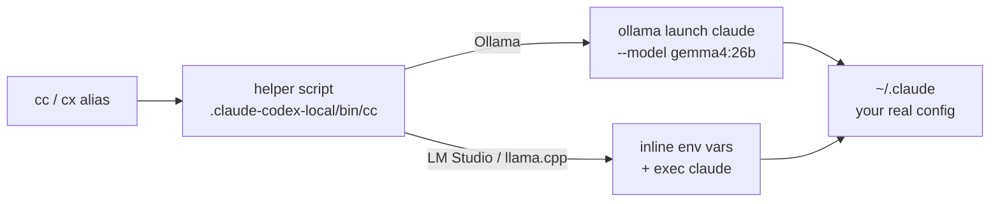
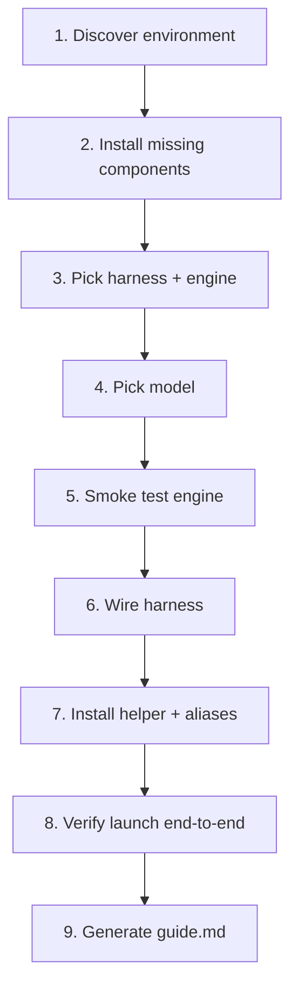

[](LICENSE)
[](https://www.python.org/downloads/)
[](https://github.com/luongnv89/claude-codex-local/actions/workflows/ci.yml)
[](https://github.com/astral-sh/ruff)

# Claude Code + Codex, running entirely on your machine

One alias (`cc` or `cx`) swaps the backend to a local model. Your skills, agents, MCP servers, and config stay untouched.

[**Get Started →**](#quick-start)

---

## How It Works



The wizard runs once and wires everything up. After that, `cc` just works. Your real `~/.claude` and `~/.codex` are never modified.

---

## Features

| Feature | What you get |
|---|---|
| Ollama first-class | `ollama launch` — no duplicated config, no custom Modelfiles |
| Config untouched | All skills, statusline, agents, plugins, and MCP servers carry over |
| Smart model selection | `llmfit` analyses your hardware and picks the best quantization that fits |
| Resume on failure | Wizard persists progress — `--resume` picks up from the last completed step |
| Idempotent aliases | Re-running the wizard replaces the existing alias block, never appends |
| Cloud fallback | Run `claude` / `codex` directly (no prefix) to switch back instantly |

---

## Quick Start

### Install from PyPI (recommended)

```bash
pip install claude-codex-local
```

Or with uv:

```bash
uv tool install claude-codex-local
```

Then run the setup wizard:

```bash
claude-codex-local
```

### One-command install (no clone required)

```bash
bash <(curl -sSL https://raw.githubusercontent.com/luongnv89/claude-codex-local/main/install.sh)
```

Or with wget:

```bash
bash <(wget -qO- https://raw.githubusercontent.com/luongnv89/claude-codex-local/main/install.sh)
```

> Use `bash <(...)`, not `curl … | bash`. The wizard is interactive and needs a real TTY — piping steals stdin.

Override defaults with env vars:

```bash
CCL_REF=v0.2.0 CCL_INSTALL_DIR=~/tools/claude-codex-local \
  bash <(curl -sSL https://raw.githubusercontent.com/luongnv89/claude-codex-local/main/install.sh)
```

### Install from a clone

```bash
git clone https://github.com/luongnv89/claude-codex-local.git
cd claude-codex-local
```

```bash
python3 -m venv .venv && source .venv/bin/activate
pip install -r requirements.txt
```

```bash
./bin/claude-codex-local
```

### After setup

Reload your shell so the alias is available:

```bash
source ~/.zshrc   # or source ~/.bashrc
```

Then run:

```bash
cc        # Claude Code → local model
cx        # Codex CLI → local model
```

---

## Wizard Steps



See [`guide.example.md`](guide.example.md) for the personalized daily-use guide the wizard generates.

---

## Usage

```bash
./bin/claude-codex-local setup --harness claude --engine ollama   # skip prefs picker
./bin/claude-codex-local setup --non-interactive                  # CI-friendly
./bin/claude-codex-local setup --resume                           # resume after failure
./bin/claude-codex-local find-model                               # standalone model recommendation
```

Diagnostic helpers:

```bash
./bin/poc-doctor            # wizard state + presence check
./bin/poc-machine-profile   # full hardware profile as JSON
./bin/poc-recommend         # llmfit-only model recommendation
```

---

## Prerequisites

- macOS or Linux with zsh or bash
- Python 3.10+
- At least one harness: [Claude Code](https://claude.ai/code) or [Codex CLI](https://github.com/openai/codex)
- At least one engine: [Ollama](https://ollama.com) (recommended), [LM Studio](https://lmstudio.ai), or llama.cpp
- [`llmfit`](https://github.com/luongnv89/llmfit) on `PATH` (optional — for automatic model selection)

---

## Proven Paths

| Harness | Engine | Model | Status |
|---|---|---|---|
| Claude Code | Ollama | `gemma4:26b` | Verified end-to-end |
| Codex CLI | Ollama | `gemma4:26b` | Verified |
| Codex CLI | Ollama | `qwen2.5-coder:0.5b` | Verified |
| Claude Code | LM Studio | Qwen3 family | Blocked — `400 thinking.type`; wizard warns and recommends alternatives |
| Any | llama.cpp | any | Inline-env code path exists, no live proof yet |

---

## Rollback

```bash
# Remove the fenced block from ~/.zshrc (between the marker lines)
rm -rf .claude-codex-local
```

That's it. Your `~/.claude` and `~/.codex` are unchanged.

---

<details>
<summary>Architecture details</summary>

### Three layers

1. **Machine profile + model recommendation** (`poc_bridge.py`) — dumps a JSON snapshot of installed harnesses/engines/llmfit/disk, runs `llmfit` for ranked model recommendations, and provides a `doctor` command for pretty-printing wizard state.

2. **Interactive wizard** (`wizard.py`) — 9 steps from discovery to ready-to-use daily alias. Persists progress in `.claude-codex-local/wizard-state.json` so `--resume` picks up after a failure.

3. **Helper scripts + shell aliases** — `.claude-codex-local/bin/cc` (or `cx`) is a short bash wrapper. For Ollama it runs `ollama launch claude|codex --model <tag>`. For LM Studio / llama.cpp it sets inline env vars and execs the real harness. A fenced block in `~/.zshrc` / `~/.bashrc` declares the aliases.

### Why `ollama launch`

`ollama launch claude --model <tag>` is an official Ollama subcommand that sets the right env vars internally and execs the user's real `claude` binary against the local daemon — using `~/.claude` as-is.

This means:
- No duplicated `~/.claude` directory
- No custom Modelfile or `ollama create`
- No `ANTHROPIC_CUSTOM_MODEL_OPTION` to manage manually
- `cc` just works

### Claude Code → LM Studio / llama.cpp env vars

| Env var | LM Studio | llama.cpp |
|---|---|---|
| `ANTHROPIC_BASE_URL` | `http://localhost:1234` | `http://localhost:8001` |
| `ANTHROPIC_API_KEY` | `lmstudio` | `sk-local` |
| `ANTHROPIC_CUSTOM_MODEL_OPTION` | `<tag>` | `<tag>` |
| `ANTHROPIC_CUSTOM_MODEL_OPTION_NAME` | `Local (lmstudio) <tag>` | `Local (llamacpp) <tag>` |
| `CLAUDE_CODE_ATTRIBUTION_HEADER` | `"0"` | `"0"` |
| `CLAUDE_CODE_DISABLE_NONESSENTIAL_TRAFFIC` | `"1"` | `"1"` |

### Codex CLI → Ollama

```bash
ollama launch codex --model <tag> -- --oss --local-provider=ollama
```

The `--oss --local-provider=ollama` flags are required after `--` because Codex otherwise tries to route through the ChatGPT account and rejects non-OpenAI model names.

### Qwen3 + Claude Code

Claude Code sends a `thinking` payload that Qwen3 reasoning models interpret as an unterminated `<think>` block. The wizard detects Qwen3 model names at pick time and recommends Gemma 3 or Qwen 2.5 Coder instead.

</details>

<details>
<summary>Project structure</summary>

```
.
├── bin/
│   ├── claude-codex-local      # Main wizard entrypoint
│   ├── poc-doctor              # Diagnostic: wizard state
│   ├── poc-machine-profile     # Diagnostic: hardware profile
│   └── poc-recommend           # Diagnostic: model recommendation
├── scripts/
│   └── e2e_smoke.sh            # End-to-end smoke test
├── docs/
│   ├── poc-wizard.md           # 9-step wizard architecture
│   ├── poc-architecture.md     # System design overview
│   ├── poc-bootstrap.md        # Bootstrap / install flow
│   └── poc-proof.md            # Design rationale
├── tests/                      # pytest test suite
├── wizard.py                   # Interactive setup wizard (core logic)
├── poc_bridge.py               # Backend bridge / harness wiring
├── install.sh                  # One-command remote installer
└── pyproject.toml              # Project metadata and tool config
```

</details>

<details>
<summary>Tech stack</summary>

| Layer | Tool |
|---|---|
| Language | Python 3.10+ |
| UI / prompts | [questionary](https://github.com/tmbo/questionary), [rich](https://github.com/Textualize/rich) |
| Linting | [ruff](https://github.com/astral-sh/ruff) |
| Type checking | [mypy](https://mypy-lang.org) |
| Testing | [pytest](https://pytest.org) + pytest-cov |
| Security | [bandit](https://github.com/PyCQA/bandit), [detect-secrets](https://github.com/Yelp/detect-secrets) |
| Pre-commit | [pre-commit](https://pre-commit.com) |

</details>

<details>
<summary>Local state</summary>

Everything written by the bridge goes under `.claude-codex-local/`. Override with `CLAUDE_CODEX_LOCAL_STATE_DIR`.

</details>

<details>
<summary>Contributing</summary>

Contributions are welcome. Read [CONTRIBUTING.md](CONTRIBUTING.md) before opening a PR.

For security issues, see [SECURITY.md](SECURITY.md).

</details>

---

[MIT](LICENSE) — © 2024 Luong NGUYEN
