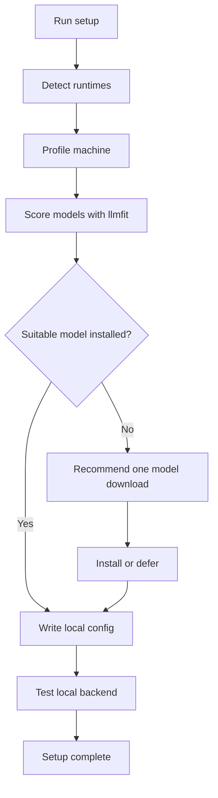
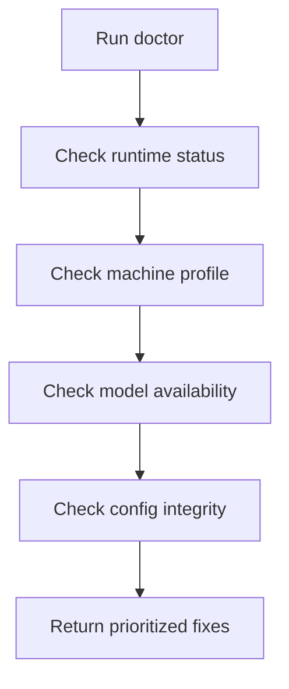
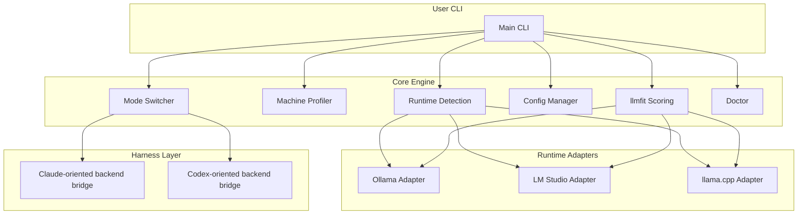

# Product Requirements Document: claude-local / codex-local

| Field | Value |
|-------|-------|
| Product Name | claude-local / codex-local |
| Version | 1.0 |
| Last Updated | 2026-04-09 |
| Status | Draft |

---

## 1. Product Overview

### 1.1 Product Vision
Give Claude Code and Codex users a local backend mode that preserves their existing harness and workflow while swapping the underlying model backend to the best-fit local runtime/model available on their machine.

### 1.2 Target Users
- Claude Code power users who run into quota/rate/network/privacy constraints
- Codex users who want a local backend path without abandoning their existing CLI workflow
- Local-LLM tinkerers who want an easier coding-focused setup than manual runtime/model tuning
- Developers who want to keep official cloud tools as primary, but have a reliable local backup mode

### 1.3 Business Objectives
- Prove there is demand for a coding-focused local backend bridge, not just another generic LLM launcher
- Reduce time-to-first-local-session from “hours of setup” to “one setup command + one run command”
- Create a differentiated wedge around **workflow continuity** rather than raw model quality claims
- Build a strong CLI product that can later expand into richer local-agent or editor integrations

### 1.4 Core Product Principle
**Do not replace Claude Code or Codex. Keep the harness. Swap the backend.**

### 1.5 Naming
- **`claude-local`** for the Claude Code path
- **`codex-local`** for the Codex path

### 1.6 UX Constraint
There should be **no major change in how users use Claude Code or Codex**. The backend changes; the user workflow should stay as familiar as possible.

### 1.7 Success Metrics

| Metric | Target | Measurement Method |
|--------|--------|-------------------|
| Setup success rate | >80% | `setup` completion telemetry / logs |
| Time to first local session | <10 min | Start/end timing during setup flow |
| Local session success rate | >70% | Successful run completion without critical config errors |
| Runtime detection coverage | >90% for supported runtimes | Detection diagnostics |
| Model recommendation acceptance | >50% | User chooses top recommended model / config |
| Return-to-official reliability | >95% | Successful switch-back command runs |

---

## 2. User Personas

### Persona 1: Claude Code Power User
- **Demographics**: solo developer or indie hacker, uses terminal daily
- **Goals**: keep shipping even when Anthropic quota or connectivity becomes a problem
- **Pain Points**:
  - runs out of tokens at the worst time
  - local model setup is tedious and confusing
  - doesn’t want to lose existing Claude Code habits
- **User Journey**:
  - uses Claude Code normally
  - hits quota / wants local mode
  - runs setup once, then switches to local backend with one command
- **Quote**: “I don’t want a new tool. I want my current tool to keep working with a local brain.”

### Persona 2: Codex CLI User
- **Demographics**: terminal-native developer, comfortable with OpenAI tooling
- **Goals**: keep Codex-style workflow but use local models when needed
- **Pain Points**:
  - backend setup differs by runtime
  - model selection is unclear
  - local performance/quality tradeoffs are hard to reason about
- **User Journey**:
  - installs the tool
  - detects Ollama / LM Studio / llama.cpp
  - gets best-fit model recommendation via `llmfit`
  - runs local backend mode without touching official Codex config
- **Quote**: “If I already know Codex, I shouldn’t need to learn a second product to go local.”

### Persona 3: Privacy-Conscious Local LLM User
- **Demographics**: engineer or consultant handling sensitive code / working offline
- **Goals**: keep code local without giving up coding-agent ergonomics
- **Pain Points**:
  - generic local chat apps are not optimized for coding workflows
  - configuration across runtimes is fragmented
  - coding model choice is trial-and-error
- **User Journey**:
  - wants local-only mode from day one
  - uses setup + doctor commands to get an optimized coding profile
  - keeps cloud mode available but separate
- **Quote**: “I want local coding help that feels operational, not like a toy demo.”

---

## 3. Feature Requirements

### 3.1 Feature Matrix

| ID | Feature | Description | Priority | Acceptance Criteria | Dependencies |
|----|---------|-------------|----------|---------------------|--------------|
| F1 | Runtime detection | Detect Ollama, LM Studio, llama.cpp installations and health | Must-have | Detect installed/active runtimes with clear status | None |
| F2 | Machine profiling | Inspect CPU, RAM, GPU/VRAM, OS, available acceleration | Must-have | Build machine profile used by model scoring | F1 |
| F3 | `llmfit` scoring | Rank installed and candidate models for coding on this machine | Must-have | Return one best-fit recommendation per mode | F1, F2 |
| F4 | Setup command | One-command setup that configures local backend mode | Must-have | User can complete setup without manual file surgery | F1, F2, F3 |
| F5 | Local run command | Launch local backend mode for Claude/Codex-oriented usage | Must-have | User can start local session from CLI | F4 |
| F6 | Official/local switching | Explicitly switch between official and local backend mode | Must-have | Switch is reversible and does not break official setup | F4 |
| F7 | Separate config storage | Store tool state/config outside official Claude/Codex config | Must-have | No overwrite of official configs by default | F4 |
| F8 | Mode presets | Balanced / Fast / Quality selection | Should-have | Presets change recommendation + runtime params | F3 |
| F9 | Download recommendation | Suggest one model to install if no fit model exists | Should-have | User gets one opinionated install path | F3 |
| F10 | Doctor command | Diagnose missing runtime, model, or config issues | Should-have | Errors mapped to actionable fixes | F1, F2, F4 |
| F11 | Codex-oriented bridge mode | Codex-friendly local backend profile | Should-have | Codex users can run local path cleanly | F4 |
| F12 | Claude-oriented bridge mode | Claude Code-friendly local backend profile | Should-have | Claude users can run local path cleanly | F4 |
| F13 | Lightweight benchmark sanity check | Optional quick coding-oriented validation | Could-have | User can compare recommended models on a small eval | F3 |
| F14 | Additional runtime support | Add vLLM / other server runtimes later | Could-have | New adapter added without rewriting core flow | Core architecture |

### 3.2 Feature Details

#### F1: Runtime detection

**Description**: Detect whether Ollama, LM Studio, and llama.cpp are installed and/or running, and normalize them into one internal adapter interface.

**User Stories**:
- As a user, I want the tool to find my local runtimes automatically so I don’t have to configure each one manually.

**Acceptance Criteria**:
- [ ] Tool detects whether Ollama is installed and reachable
- [ ] Tool detects whether LM Studio local server is available
- [ ] Tool detects whether llama.cpp server or compatible endpoint is available
- [ ] Tool prints a consistent status summary per runtime
- [ ] Detection failures explain what is missing and how to fix it

**Edge Cases**:
- runtime binary exists but service is not running
- multiple runtimes are available at once
- runtime exists but no compatible models are present

#### F2: Machine profiling

**Description**: Build a hardware profile to avoid recommending nonsense model setups.

**Acceptance Criteria**:
- [ ] Detect OS, architecture, CPU, RAM
- [ ] Detect GPU/VRAM or fallback to CPU-only mode
- [ ] Capture acceleration capability (Metal/CUDA where applicable)
- [ ] Output profile is usable by model scoring engine

#### F3: `llmfit` scoring

**Description**: Use `llmfit` to choose the best coding model for the user’s machine and preferred mode.

**Acceptance Criteria**:
- [ ] Returns one best-fit installed model for Balanced mode
- [ ] Returns alternative picks for Fast and Quality modes
- [ ] Recommends one download if no suitable installed model exists
- [ ] Explains why a model was chosen in short human-readable terms

#### F4: Setup command

**Description**: Configure local backend mode in one guided command.

**Acceptance Criteria**:
- [ ] `setup` runs detection + profiling + scoring
- [ ] Writes local tool config to a separate namespace
- [ ] Does not overwrite official Claude/Codex config by default
- [ ] Tests one local backend connection before completion

#### F5: Local run command

**Description**: Launch a local coding session while preserving the harness mental model.

**Acceptance Criteria**:
- [ ] User can run local mode with one command
- [ ] Tool shows which runtime/model/preset is active
- [ ] Failure states tell user how to recover or switch back

#### F6: Official/local switching

**Description**: Explicitly switch to local mode or back to official mode.

**Acceptance Criteria**:
- [ ] `use local` activates local backend profile
- [ ] `use official` restores official backend behavior
- [ ] Switching back does not require reinstalling anything

---

## 4. User Flows

### 4.1 First-time setup flow

**Description**: A user installs the tool and configures a working local backend for the first time.

**Steps**:
1. User runs `setup`
2. Tool detects supported runtimes
3. Tool profiles machine hardware
4. Tool uses `llmfit` to score local coding models
5. Tool either selects best installed model or recommends one download
6. Tool writes separate local config
7. Tool validates a test run
8. Tool confirms how to run local mode and how to switch back to official

### 4.2 Switch-to-local flow

**Description**: A user already has the tool configured and wants to switch into local backend mode.

**Steps**:
1. User runs `use local` or `run --local`
2. Tool loads stored preferred runtime/model/profile
3. Tool confirms active backend and preset
4. Local session starts

### 4.3 Switch-back-to-official flow

**Description**: A user wants to return to official Claude/Codex models.

**Steps**:
1. User runs `use official`
2. Tool restores official backend settings/route
3. User continues with their normal cloud workflow

### 4.4 Doctor flow

**Description**: A user has a broken setup and wants guided diagnosis.

**Steps**:
1. User runs `doctor`
2. Tool checks runtime availability, model availability, config validity, and backend health
3. Tool prints concrete fixes in priority order

---

## 5. Non-Functional Requirements

### 5.1 Performance

| Requirement | Target | Notes |
|-------------|--------|-------|
| Setup completion | < 3 min excluding model downloads | Local checks should be quick |
| Runtime detection | < 10 sec | On a normal developer machine |
| Switching mode | < 5 sec | Should feel instant-ish |
| Doctor results | < 15 sec | Fast enough to be used often |
| Startup messaging | immediate | Always show active backend + model |

### 5.2 Reliability
- Setup should be resumable after partial failure
- Config should be recoverable if corrupted
- Switching back to official mode should be highly reliable
- No destructive modification of official tool config by default

### 5.3 Security
- No silent exfiltration of project data during local-mode setup
- Local config stored separately from official credentials
- Any optional telemetry must be opt-in
- Secrets/tokens handled minimally and never logged in plaintext

### 5.4 Compatibility

| Platform | Requirement |
|----------|-------------|
| macOS | Supported in MVP |
| Linux | Supported in MVP |
| Windows | Nice-to-have after MVP unless easy |
| Runtimes | Ollama, LM Studio, llama.cpp |
| Harnesses | Claude-oriented and Codex-oriented workflows |

### 5.5 UX constraints
- Product must never imply parity with frontier cloud models when local models are weaker
- Recommendations should be opinionated and minimal, not a giant model zoo menu
- Mode labels should be simple: Balanced / Fast / Quality

---

## 6. Technical Specifications

### 6.1 High-Level Architecture

### 6.2 Core modules

| Module | Responsibility | Notes |
|--------|---------------|-------|
| Runtime detection | Discover runtimes and health | Adapter-based |
| Machine profiler | Capture hardware capabilities | Input to scoring |
| Model scoring | Call `llmfit` and rank candidates | Core differentiation |
| Config manager | Store local profiles separately | Must not clobber official setup |
| Mode switcher | Activate local or official path | Explicit and reversible |
| Doctor | Explain broken state and recovery | High leverage for DX |
| Harness bridges | Claude/Codex-oriented backend glue | Preserve user workflow |

### 6.3 Configuration strategy
- Store local tool config under a separate namespace, e.g. `~/.config/<tool>/`
- Keep track of:
  - preferred runtime
  - preferred model per mode
  - machine profile
  - last-known-good config
  - optional install recommendations
- Avoid mutating official Claude Code / Codex configs unless explicitly requested

### 6.4 Runtime adapters
Each supported runtime should implement a shared internal interface:
- `detect()`
- `healthcheck()`
- `list_models()`
- `run_test()`
- `recommend_params(mode)`

### 6.5 Modes
- **Balanced**: default; optimize for usable coding quality + acceptable speed
- **Fast**: prioritize responsiveness on weaker machines
- **Quality**: prioritize stronger model choice when hardware supports it

### 6.6 Proposed commands
- `claude-local` (Claude-oriented local backend path)
- `codex-local` (Codex-oriented local backend path)
- setup / status / doctor / use-local / use-official helpers may still exist behind the scenes

The visible product should minimize workflow change and keep the harness experience familiar.

---

## 7. Analytics & Monitoring

### 7.1 Key product metrics

| Category | Metric | Description | Target |
|----------|--------|-------------|--------|
| Activation | Setup success | Completed setup / started setup | >80% |
| Usability | Time to first local run | Setup start to first working local session | <10 min |
| Reliability | Doctor resolution rate | Issues resolved after doctor guidance | >60% |
| Adoption | Repeat local usage | Users coming back to local mode | >40% |
| Trust | Switch-back success | Official mode restored successfully | >95% |

### 7.2 Events to track (opt-in if telemetry exists)

| Event | Trigger | Properties |
|-------|---------|------------|
| setup_started | user runs setup | OS, runtime candidates |
| runtime_detected | runtime found | runtime type |
| model_scored | llmfit returns result | selected model, mode |
| local_run_started | local mode starts | runtime, model, preset |
| switch_to_official | user switches back | prior runtime/model |
| doctor_run | user runs doctor | failure category |

### 7.3 Observability
- Local structured logs for detection/setup/doctor flow
- Redact secrets/tokens from logs
- Provide user-visible verbose/debug modes for troubleshooting

---

## 8. Release Planning

### 8.1 MVP (v1.0)
**Goal**: ship a trustworthy local backend setup + switching flow with minimal user workflow change.

**Scope**:
- [ ] Detect Ollama, LM Studio, llama.cpp
- [ ] Profile machine hardware
- [ ] Integrate `llmfit`
- [ ] Recommend best installed model per mode
- [ ] Support setup, status, run, doctor
- [ ] Keep official configs untouched
- [ ] Support explicit local/offical switching

**Out of scope for MVP**:
- full Windows polish
- vLLM support
- rich editor integrations
- heavy benchmarking suite

### 8.2 Version 1.1
- [ ] One-click recommended model download guidance
- [ ] Better error recovery / doctor UX
- [ ] Improved Claude/Codex bridge polish
- [ ] Smarter caching of last-good profile

### 8.3 Version 2.0
- [ ] vLLM or server-grade runtime support if justified
- [ ] lightweight coding benchmark / validation mode
- [ ] richer workflow integrations
- [ ] team/shared machine profile presets

---

## 9. Open Questions & Risks

### 9.1 Open Questions

| # | Question | Impact | Owner | Due |
|---|----------|--------|-------|-----|
| 1 | What exact CLI/product name should be used? | Medium | Product | Before MVP branding |
| 2 | What is the cleanest bridge strategy for Claude-oriented usage? | High | Engineering | Before implementation |
| 3 | How much Codex-specific behavior needs explicit handling vs generic backend switching? | High | Engineering | Before adapter work |
| 4 | Should model download be built-in or only recommended? | Medium | Product | Before setup finalization |
| 5 | What telemetry, if any, is acceptable for a privacy-sensitive audience? | Medium | Product | Before public release |

### 9.2 Assumptions

| # | Assumption | Risk if Wrong | Validation |
|---|------------|---------------|------------|
| 1 | Users care more about continuity than absolute parity | Product weaker if false | User interviews / dogfooding |
| 2 | `llmfit` can produce meaningfully better picks than static defaults | Differentiation weakens | Compare recommendation quality |
| 3 | Supported runtimes expose enough stable hooks for automation | Adapter complexity increases | Early prototype spikes |
| 4 | Users are okay with explicit switching instead of fully transparent magic | UX may feel clunky | Prototype testing |

### 9.3 Risks

| Risk | Probability | Impact | Mitigation |
|------|-------------|--------|------------|
| Local model quality disappoints | High | High | Honest positioning, recommended presets |
| Runtime differences create fragile adapter layer | Medium | High | Narrow MVP runtime set, adapter abstraction |
| Official harness integration is harder than expected | Medium | High | Bridge prototype early, keep fallback behavior explicit |
| Naming causes expectation trap | High | Medium | Avoid “offline Claude Code” framing |
| Users face config confusion | Medium | Medium | Strong setup/doctor UX |

---

## 10. Appendix

### 10.1 Competitive framing

| Product / Approach | What it does well | Gap vs this PRD |
|--------------------|-------------------|-----------------|
| Ollama / LM Studio / llama.cpp | Local runtime execution | No coding-focused fallback orchestration |
| Generic local wrappers | Launch local models | Weak workflow continuity |
| Model routers | Normalize backends | Often not coding/harness focused |
| Local coding tools | Provide coding UX | May replace workflow instead of preserving harness |

### 10.2 Positioning statement
**The product is not an offline Claude/Codex clone. It is a local backend bridge that keeps the existing harness while swapping the model engine.**

### 10.3 Naming statement
- `claude-local` = Claude Code with a local backend
- `codex-local` = Codex with a local backend
- The point is continuity, not replacement

### 10.4 Revision history

| Version | Date | Author | Changes |
|---------|------|--------|---------|
| 1.1 | 2026-04-09 | Olak | Refined around `claude-local` / `codex-local` naming and no-workflow-change constraint |
| 1.0 | 2026-04-09 | Olak | Initial PRD draft |
